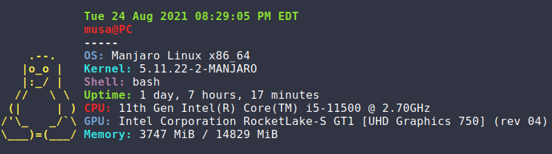

# ifetch
> An extremely lightweight alternative to neofetch, pfetch, ufetch, etc.a
> ***If you like this project be sure to give it a star!***
>
> 

---

## What is this?
ifetch is meant to be an extremely lightweight alternative to other fetch programs such as
**neofetch, pfetch, ufetch**, etc. It fetches the most important information about your system
including the i **OS, Kernel, Shell**, and more. ifetch ***DOES NOT*** waste time printing custom
ASCII art for your distro. Instead, ifetch prints a small cute ASCII Tux.

## Another fetch program?
Yes. I made this as a fun personal project and because I wanted to make a more lightweight version of other system fetchers; specifically neofetch.
This project was made in the spirit of being lightweight and small. In the spirit of being lightweight, ***ifetch is less than 100 lines of code!***

## Contributions
Although I think I've added all the relevant infomation needed to the script, feel free to create a pull request. I'll take a look
at it and decide if it should be added. In terms of **Styling** please feel free to contribute a better styled version
of the script. I quickly put some colors on the screen but I'm sure it can improved.

## License
This project uses the **MIT license**, feel free to use, modify, and redistribute it as you please. Refer to the license for more information.
